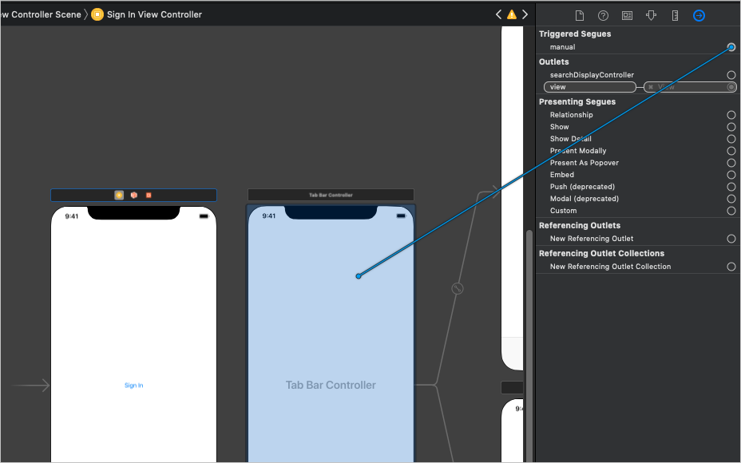
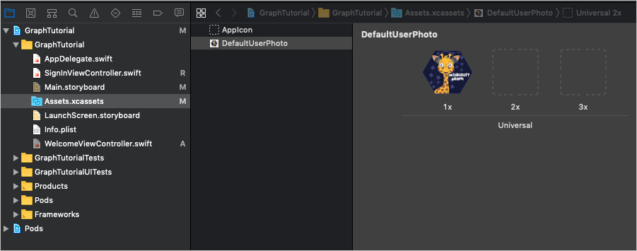
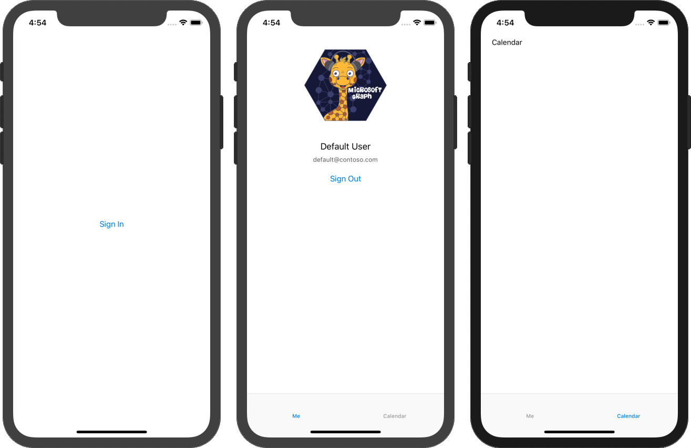

<!-- markdownlint-disable MD002 MD041 -->

<span data-ttu-id="bfc64-101">Commencez par créer un projet SWIFT.</span><span class="sxs-lookup"><span data-stu-id="bfc64-101">Begin by creating a new Swift project.</span></span>

1. <span data-ttu-id="bfc64-102">Ouvrez Xcode.</span><span class="sxs-lookup"><span data-stu-id="bfc64-102">Open Xcode.</span></span> <span data-ttu-id="bfc64-103">Dans le menu **fichier** , sélectionnez **nouveau**, puis **projet**.</span><span class="sxs-lookup"><span data-stu-id="bfc64-103">On the **File** menu, select **New**, then **Project**.</span></span>
1. <span data-ttu-id="bfc64-104">Choisissez le modèle d' **application vue unique** , puis sélectionnez **suivant**.</span><span class="sxs-lookup"><span data-stu-id="bfc64-104">Choose the **Single View App** template and select **Next**.</span></span>

    

1. <span data-ttu-id="bfc64-106">Définissez le **nom** du produit `GraphTutorial` sur et la **langue** sur **objectif-C**.</span><span class="sxs-lookup"><span data-stu-id="bfc64-106">Set the **Product Name** to `GraphTutorial` and the **Language** to **Objective-C**.</span></span>
1. <span data-ttu-id="bfc64-107">Renseignez les champs restants, puis cliquez sur **suivant**.</span><span class="sxs-lookup"><span data-stu-id="bfc64-107">Fill in the remaining fields and select **Next**.</span></span>
1. <span data-ttu-id="bfc64-108">Choisissez un emplacement pour le projet et sélectionnez **créer**.</span><span class="sxs-lookup"><span data-stu-id="bfc64-108">Choose a location for the project and select **Create**.</span></span>

## <a name="install-dependencies"></a><span data-ttu-id="bfc64-109">Installer les dépendances</span><span class="sxs-lookup"><span data-stu-id="bfc64-109">Install dependencies</span></span>

<span data-ttu-id="bfc64-110">Avant de poursuivre, installez des dépendances supplémentaires que vous utiliserez plus tard.</span><span class="sxs-lookup"><span data-stu-id="bfc64-110">Before moving on, install some additional dependencies that you will use later.</span></span>

- <span data-ttu-id="bfc64-111">[Bibliothèque d’authentification Microsoft (MSAL) pour iOS](https://github.com/AzureAD/microsoft-authentication-library-for-objc) pour l’authentification auprès d’Azure ad.</span><span class="sxs-lookup"><span data-stu-id="bfc64-111">[Microsoft Authentication Library (MSAL) for iOS](https://github.com/AzureAD/microsoft-authentication-library-for-objc) for authenticating to with Azure AD.</span></span>
- <span data-ttu-id="bfc64-112">[Fournisseur d’authentification MSAL pour l’objectif C](https://github.com/microsoftgraph/msgraph-sdk-objc-auth) permettant de connecter MSAL avec le kit de développement logiciel (SDK) Microsoft Graph.</span><span class="sxs-lookup"><span data-stu-id="bfc64-112">[MSAL Authentication Provider for Objective C](https://github.com/microsoftgraph/msgraph-sdk-objc-auth) to connect MSAL with the Microsoft Graph SDK.</span></span>
- <span data-ttu-id="bfc64-113">[Kit de développement logiciel (SDK) Microsoft Graph pour objective C](https://github.com/microsoftgraph/msgraph-sdk-objc) pour les appels à Microsoft Graph.</span><span class="sxs-lookup"><span data-stu-id="bfc64-113">[Microsoft Graph SDK for Objective C](https://github.com/microsoftgraph/msgraph-sdk-objc) for making calls to Microsoft Graph.</span></span>
- <span data-ttu-id="bfc64-114">[Kit de développement logiciel (SDK) des modèles Microsoft Graph pour objective C](https://github.com/microsoftgraph/msgraph-sdk-objc-models) pour les objets fortement typés représentant des ressources Microsoft Graph, comme des utilisateurs ou des événements.</span><span class="sxs-lookup"><span data-stu-id="bfc64-114">[Microsoft Graph Models SDK for Objective C](https://github.com/microsoftgraph/msgraph-sdk-objc-models) for strongly-typed objects representing Microsoft Graph resources like users or events.</span></span>

1. <span data-ttu-id="bfc64-115">Quittez Xcode.</span><span class="sxs-lookup"><span data-stu-id="bfc64-115">Quit Xcode.</span></span>
1. <span data-ttu-id="bfc64-116">Ouvrez terminal et modifiez le répertoire à l’emplacement de votre projet **GraphTutorial** .</span><span class="sxs-lookup"><span data-stu-id="bfc64-116">Open Terminal and change the directory to the location of your **GraphTutorial** project.</span></span>
1. <span data-ttu-id="bfc64-117">Exécutez la commande suivante pour créer un Podfile.</span><span class="sxs-lookup"><span data-stu-id="bfc64-117">Run the following command to create a Podfile.</span></span>

    ```Shell
    pod init
    ```

1. <span data-ttu-id="bfc64-118">Ouvrez le Podfile et ajoutez les lignes suivantes juste après la `use_frameworks!` ligne.</span><span class="sxs-lookup"><span data-stu-id="bfc64-118">Open the Podfile and add the following lines just after the `use_frameworks!` line.</span></span>

    ```Ruby
    pod 'MSAL', '~> 0.3.0'
    pod 'MSGraphMSALAuthProvider', '~> 0.1.1'
    pod 'MSGraphClientSDK', ' ~> 0.1.3'
    pod 'MSGraphClientModels', '~> 0.1.1'
    ```

1. <span data-ttu-id="bfc64-119">Enregistrez le Podfile, puis exécutez la commande suivante pour installer les dépendances.</span><span class="sxs-lookup"><span data-stu-id="bfc64-119">Save the Podfile, then run the following command to install the dependencies.</span></span>

    ```Shell
    pod install
    ```

1. <span data-ttu-id="bfc64-120">Une fois la commande exécutée, ouvrez le **GraphTutorial. xcworkspace** nouvellement créé dans Xcode.</span><span class="sxs-lookup"><span data-stu-id="bfc64-120">Once the command completes, open the newly created **GraphTutorial.xcworkspace** in Xcode.</span></span>

## <a name="design-the-app"></a><span data-ttu-id="bfc64-121">Concevoir l’application</span><span class="sxs-lookup"><span data-stu-id="bfc64-121">Design the app</span></span>

<span data-ttu-id="bfc64-122">Dans cette section, vous allez créer les affichages de l’application : une page de connexion, un navigateur de barre d’onglets, une page d’accueil et une page de calendrier.</span><span class="sxs-lookup"><span data-stu-id="bfc64-122">In this section you will create the views for the app: a sign in page, a tab bar navigator, a welcome page, and a calendar page.</span></span> <span data-ttu-id="bfc64-123">Vous allez également créer une superposition des indicateurs d’activité.</span><span class="sxs-lookup"><span data-stu-id="bfc64-123">You'll also create an activity indicator overlay.</span></span>

### <a name="create-sign-in-page"></a><span data-ttu-id="bfc64-124">Créer une page de connexion</span><span class="sxs-lookup"><span data-stu-id="bfc64-124">Create sign in page</span></span>

1. <span data-ttu-id="bfc64-125">Développez le dossier **GraphTutorial** dans Xcode, puis sélectionnez le fichier **ViewController. m** .</span><span class="sxs-lookup"><span data-stu-id="bfc64-125">Expand the **GraphTutorial** folder in Xcode, then select the **ViewController.m** file.</span></span>
1. <span data-ttu-id="bfc64-126">Dans l' **inspecteur de fichiers**, remplacez le **nom** du fichier par `SignInViewController.m`.</span><span class="sxs-lookup"><span data-stu-id="bfc64-126">In the **File Inspector**, change the **Name** of the file to `SignInViewController.m`.</span></span>

    

1. <span data-ttu-id="bfc64-128">Ouvrez **SignInViewController. m** et remplacez son contenu par le code suivant.</span><span class="sxs-lookup"><span data-stu-id="bfc64-128">Open **SignInViewController.m** and replace its contents with the following code.</span></span>

    ```objc
    #import "SignInViewController.h"

    @interface SignInViewController ()

    @end

    @implementation SignInViewController

    - (void)viewDidLoad {
        [super viewDidLoad];
        // Do any additional setup after loading the view.
    }

    - (IBAction)signIn {
        [self performSegueWithIdentifier: @"userSignedIn" sender: nil];
    }
    @end
    ```

1. <span data-ttu-id="bfc64-129">Sélectionnez le fichier **ViewController. h** .</span><span class="sxs-lookup"><span data-stu-id="bfc64-129">Select the **ViewController.h** file.</span></span>
1. <span data-ttu-id="bfc64-130">Dans l' **inspecteur de fichiers**, remplacez le **nom** du fichier par `SignInViewController.h`.</span><span class="sxs-lookup"><span data-stu-id="bfc64-130">In the **File Inspector**, change the **Name** of the file to `SignInViewController.h`.</span></span>
1. <span data-ttu-id="bfc64-131">Ouvrez **SignInViewController. h** et remplacez toutes les instances `ViewController` de `SignInViewController`par.</span><span class="sxs-lookup"><span data-stu-id="bfc64-131">Open **SignInViewController.h** and change all instances of `ViewController` to `SignInViewController`.</span></span>

1. <span data-ttu-id="bfc64-132">Ouvrez le fichier **principal. Storyboard** .</span><span class="sxs-lookup"><span data-stu-id="bfc64-132">Open the **Main.storyboard** file.</span></span>
1. <span data-ttu-id="bfc64-133">Développez **View Controller Scene**, puis sélectionnez **View Controller**.</span><span class="sxs-lookup"><span data-stu-id="bfc64-133">Expand **View Controller Scene**, then select **View Controller**.</span></span>

    

1. <span data-ttu-id="bfc64-135">Sélectionnez l' **inspecteur d’identité**, puis définissez la liste déroulante de **classe** sur **SignInViewController**.</span><span class="sxs-lookup"><span data-stu-id="bfc64-135">Select the **Identity Inspector**, then change the **Class** dropdown to **SignInViewController**.</span></span>

    

1. <span data-ttu-id="bfc64-137">Sélectionnez la **bibliothèque**, puis faites glisser un **bouton** sur le **contrôleur de vue de connexion**.</span><span class="sxs-lookup"><span data-stu-id="bfc64-137">Select the **Library**, then drag a **Button** onto the **Sign In View Controller**.</span></span>

    

1. <span data-ttu-id="bfc64-139">Lorsque le bouton est sélectionné, sélectionnez l' **inspecteur d’attributs** et remplacez le **titre** du bouton `Sign In`par.</span><span class="sxs-lookup"><span data-stu-id="bfc64-139">With the button selected, select the **Attributes Inspector** and change the **Title** of the button to `Sign In`.</span></span>

    

1. <span data-ttu-id="bfc64-141">Sélectionnez le **contrôleur d’affichage de connexion**, puis sélectionnez l' **inspecteur de connexions**.</span><span class="sxs-lookup"><span data-stu-id="bfc64-141">Select the **Sign In View Controller**, then select the **Connections Inspector**.</span></span>
1. <span data-ttu-id="bfc64-142">Sous **actions reçues**, faites glisser le cercle non rempli en regard de **connexion** sur le bouton.</span><span class="sxs-lookup"><span data-stu-id="bfc64-142">Under **Received Actions**, drag the unfilled circle next to **signIn** onto the button.</span></span> <span data-ttu-id="bfc64-143">Sélectionnez **retoucher** dans le menu contextuel.</span><span class="sxs-lookup"><span data-stu-id="bfc64-143">Select **Touch Up Inside** on the pop-up menu.</span></span>

    

1. <span data-ttu-id="bfc64-145">Dans le menu **éditeur** , sélectionnez **résoudre les problèmes de disposition automatique**, puis sélectionnez **Ajouter les contraintes manquantes** sous **toutes les vues dans se connecter dans le contrôleur d’affichage**.</span><span class="sxs-lookup"><span data-stu-id="bfc64-145">On the **Editor** menu, select **Resolve Auto Layout Issues**, then select **Add Missing Constraints** underneath **All Views in Sign In View Controller**.</span></span>

### <a name="create-tab-bar"></a><span data-ttu-id="bfc64-146">Créer une barre d’onglets</span><span class="sxs-lookup"><span data-stu-id="bfc64-146">Create tab bar</span></span>

1. <span data-ttu-id="bfc64-147">Sélectionnez la **bibliothèque**, puis faites glisser un **contrôleur de barre d’onglets** sur la table de montage séquentiel.</span><span class="sxs-lookup"><span data-stu-id="bfc64-147">Select the **Library**, then drag a **Tab Bar Controller** onto the storyboard.</span></span>
1. <span data-ttu-id="bfc64-148">Sélectionnez le **contrôleur d’affichage de connexion**, puis sélectionnez l' **inspecteur de connexions**.</span><span class="sxs-lookup"><span data-stu-id="bfc64-148">Select the **Sign In View Controller**, then select the **Connections Inspector**.</span></span>
1. <span data-ttu-id="bfc64-149">Sous **déclencheur SEGUES**, faites glisser le cercle qui n’est pas rempli en regard de **Manuel** sur le contrôleur de la **barre d’onglets** sur la table de montage séquentiel.</span><span class="sxs-lookup"><span data-stu-id="bfc64-149">Under **Triggered Segues**, drag the unfilled circle next to **manual** onto the **Tab Bar Controller** on the storyboard.</span></span> <span data-ttu-id="bfc64-150">Sélectionnez une **Présentation modale** dans le menu contextuel.</span><span class="sxs-lookup"><span data-stu-id="bfc64-150">Select **Present Modally** in the pop-up menu.</span></span>

    

1. <span data-ttu-id="bfc64-152">Sélectionnez le segue que vous venez d’ajouter, puis sélectionnez l' **inspecteur d’attributs**.</span><span class="sxs-lookup"><span data-stu-id="bfc64-152">Select the segue you just added, then select the **Attributes Inspector**.</span></span> <span data-ttu-id="bfc64-153">Définissez le champ **identificateur** sur `userSignedIn`.</span><span class="sxs-lookup"><span data-stu-id="bfc64-153">Set the **Identifier** field to `userSignedIn`.</span></span>

    

1. <span data-ttu-id="bfc64-155">Sélectionnez la **scène de l’élément 1**, puis sélectionnez l' **inspecteur de connexions**.</span><span class="sxs-lookup"><span data-stu-id="bfc64-155">Select the **Item 1 Scene**, then select the **Connections Inspector**.</span></span>
1. <span data-ttu-id="bfc64-156">Sous **déclencheur SEGUES**, faites glisser le cercle non rempli en regard de **Manuel** sur le **contrôleur de vue de connexion** sur la table de montage séquentiel.</span><span class="sxs-lookup"><span data-stu-id="bfc64-156">Under **Triggered Segues**, drag the unfilled circle next to **manual** onto the **Sign In View Controller** on the storyboard.</span></span> <span data-ttu-id="bfc64-157">Sélectionnez une **Présentation modale** dans le menu contextuel.</span><span class="sxs-lookup"><span data-stu-id="bfc64-157">Select **Present Modally** in the pop-up menu.</span></span>
1. <span data-ttu-id="bfc64-158">Sélectionnez le segue que vous venez d’ajouter, puis sélectionnez l' **inspecteur d’attributs**.</span><span class="sxs-lookup"><span data-stu-id="bfc64-158">Select the segue you just added, then select the **Attributes Inspector**.</span></span> <span data-ttu-id="bfc64-159">Définissez le champ **identificateur** sur `userSignedOut`.</span><span class="sxs-lookup"><span data-stu-id="bfc64-159">Set the **Identifier** field to `userSignedOut`.</span></span>

### <a name="create-welcome-page"></a><span data-ttu-id="bfc64-160">Créer une page d’accueil</span><span class="sxs-lookup"><span data-stu-id="bfc64-160">Create welcome page</span></span>

1. <span data-ttu-id="bfc64-161">Sélectionnez le fichier **Assets. xcassets** .</span><span class="sxs-lookup"><span data-stu-id="bfc64-161">Select the **Assets.xcassets** file.</span></span>
1. <span data-ttu-id="bfc64-162">Dans le menu **éditeur** , sélectionnez **Ajouter des ressources**, puis **nouveau jeu d’images**.</span><span class="sxs-lookup"><span data-stu-id="bfc64-162">On the **Editor** menu, select **Add Assets**, then **New Image Set**.</span></span>
1. <span data-ttu-id="bfc64-163">Sélectionnez la nouvelle **image** et utilisez l' **inspecteur d’attributs** pour définir son **nom** sur `DefaultUserPhoto`.</span><span class="sxs-lookup"><span data-stu-id="bfc64-163">Select the new **Image** asset and use the **Attribute Inspector** to set its **Name** to `DefaultUserPhoto`.</span></span>
1. <span data-ttu-id="bfc64-164">Ajoutez l’image que vous souhaitez utiliser comme photo de profil utilisateur par défaut.</span><span class="sxs-lookup"><span data-stu-id="bfc64-164">Add any image you like to serve as a default user profile photo.</span></span>

    

1. <span data-ttu-id="bfc64-166">Créez un fichier de **classe Touch de cacao** dans le dossier **GraphTutorial** nommé `WelcomeViewController`.</span><span class="sxs-lookup"><span data-stu-id="bfc64-166">Create a new **Cocoa Touch Class** file in the **GraphTutorial** folder named `WelcomeViewController`.</span></span> <span data-ttu-id="bfc64-167">Choisissez **UIViewController** dans la sous- **classe du** champ.</span><span class="sxs-lookup"><span data-stu-id="bfc64-167">Choose **UIViewController** in the **Subclass of** field.</span></span>
1. <span data-ttu-id="bfc64-168">Ouvrez **WelcomeViewController. h** et ajoutez le code suivant à l' `@interface` intérieur de la déclaration.</span><span class="sxs-lookup"><span data-stu-id="bfc64-168">Open **WelcomeViewController.h** and add the following code inside the `@interface` declaration.</span></span>

    ```objc
    @property (nonatomic) IBOutlet UIImageView *userProfilePhoto;
    @property (nonatomic) IBOutlet UILabel *userDisplayName;
    @property (nonatomic) IBOutlet UILabel *userEmail;
    ```

1. <span data-ttu-id="bfc64-169">Ouvrez **WelcomeViewController. m** et remplacez son contenu par le code suivant.</span><span class="sxs-lookup"><span data-stu-id="bfc64-169">Open **WelcomeViewController.m** and replace its contents with the following code.</span></span>

    ```objc
    #import "WelcomeViewController.h"

    @interface WelcomeViewController ()

    @end

    @implementation WelcomeViewController

    - (void)viewDidLoad {
        [super viewDidLoad];
        // Do any additional setup after loading the view.

        // TEMPORARY
        self.userProfilePhoto.image = [UIImage imageNamed:@"DefaultUserPhoto"];
        self.userDisplayName.text = @"Default User";
        [self.userDisplayName sizeToFit];
        self.userEmail.text = @"default@contoso.com";
        [self.userEmail sizeToFit];
    }

    - (IBAction)signOut {
        [self performSegueWithIdentifier: @"userSignedOut" sender: nil];
    }

    @end
    ```

1. <span data-ttu-id="bfc64-170">Ouvrez **main. Storyboard**.</span><span class="sxs-lookup"><span data-stu-id="bfc64-170">Open **Main.storyboard**.</span></span> <span data-ttu-id="bfc64-171">Sélectionnez la **scène de l’élément 1**, puis sélectionnez l' **inspecteur d’identité**.</span><span class="sxs-lookup"><span data-stu-id="bfc64-171">Select the **Item 1 Scene**, then select the **Identity Inspector**.</span></span> <span data-ttu-id="bfc64-172">Remplacez la valeur de la **classe** par **WelcomeViewController**.</span><span class="sxs-lookup"><span data-stu-id="bfc64-172">Change the **Class** value to **WelcomeViewController**.</span></span>
1. <span data-ttu-id="bfc64-173">À l’aide de la **bibliothèque**, ajoutez les éléments suivants à la scène de l' **élément 1**.</span><span class="sxs-lookup"><span data-stu-id="bfc64-173">Using the **Library**, add the following items to the **Item 1 Scene**.</span></span>

    - <span data-ttu-id="bfc64-174">Affichage d’une **image**</span><span class="sxs-lookup"><span data-stu-id="bfc64-174">One **Image View**</span></span>
    - <span data-ttu-id="bfc64-175">Deux **étiquettes**</span><span class="sxs-lookup"><span data-stu-id="bfc64-175">Two **Labels**</span></span>
    - <span data-ttu-id="bfc64-176">Un **bouton**</span><span class="sxs-lookup"><span data-stu-id="bfc64-176">One **Button**</span></span>

1. <span data-ttu-id="bfc64-177">Sélectionnez la vue image, puis l' **inspecteur de taille**.</span><span class="sxs-lookup"><span data-stu-id="bfc64-177">Select the image view, then select the **Size Inspector**.</span></span>
1. <span data-ttu-id="bfc64-178">Définissez la **largeur** et la **hauteur** sur 196.</span><span class="sxs-lookup"><span data-stu-id="bfc64-178">Set the **Width** and **Height** to 196.</span></span>
1. <span data-ttu-id="bfc64-179">Sélectionnez la deuxième étiquette, puis l' **inspecteur d’attributs**.</span><span class="sxs-lookup"><span data-stu-id="bfc64-179">Select the second label, then select the **Attributes Inspector**.</span></span>
1. <span data-ttu-id="bfc64-180">Modifiez la **couleur** en **gris foncé**et remplacez la **police** par le **système 12,0**.</span><span class="sxs-lookup"><span data-stu-id="bfc64-180">Change the **Color** to **Dark Gray Color**, and change the **Font** to **System 12.0**.</span></span>
1. <span data-ttu-id="bfc64-181">Sélectionnez le bouton, puis l' **inspecteur d’attributs**.</span><span class="sxs-lookup"><span data-stu-id="bfc64-181">Select the button, then select the **Attributes Inspector**.</span></span>
1. <span data-ttu-id="bfc64-182">Remplacez le **titre** par `Sign Out`.</span><span class="sxs-lookup"><span data-stu-id="bfc64-182">Change the **Title** to `Sign Out`.</span></span>
1. <span data-ttu-id="bfc64-183">À l’aide de l' **inspecteur de connexions**, effectuez les connexions suivantes.</span><span class="sxs-lookup"><span data-stu-id="bfc64-183">Using the **Connections Inspector**, make the following connections.</span></span>

    - <span data-ttu-id="bfc64-184">Liez la sortie **userDisplayName** à la première étiquette.</span><span class="sxs-lookup"><span data-stu-id="bfc64-184">Link the **userDisplayName** outlet to the first label.</span></span>
    - <span data-ttu-id="bfc64-185">Reliez la sortie de **userEmail** à la deuxième étiquette.</span><span class="sxs-lookup"><span data-stu-id="bfc64-185">Link the **userEmail** outlet to the second label.</span></span>
    - <span data-ttu-id="bfc64-186">Liez la sortie **userProfilePhoto** à la vue d’image.</span><span class="sxs-lookup"><span data-stu-id="bfc64-186">Link the **userProfilePhoto** outlet to the image view.</span></span>
    - <span data-ttu-id="bfc64-187">Liez l’action **signOut** reçue au bouton **retoucher dans**.</span><span class="sxs-lookup"><span data-stu-id="bfc64-187">Link the **signOut** received action to the button's **Touch Up Inside**.</span></span>

1. <span data-ttu-id="bfc64-188">Sélectionnez l’élément de la barre d’onglets au bas de la scène, puis sélectionnez l' **inspecteur des attributs**.</span><span class="sxs-lookup"><span data-stu-id="bfc64-188">Select the tab bar item at the bottom of the scene, then select the **Attributes Inspector**.</span></span> <span data-ttu-id="bfc64-189">Remplacez le **titre** par `Me`.</span><span class="sxs-lookup"><span data-stu-id="bfc64-189">Change the **Title** to `Me`.</span></span>
1. <span data-ttu-id="bfc64-190">Dans le menu **éditeur** , sélectionnez **résoudre les problèmes de disposition automatique**, puis sélectionnez **Ajouter les contraintes manquantes** sous **toutes les vues dans le contrôleur d’affichage de bienvenue**.</span><span class="sxs-lookup"><span data-stu-id="bfc64-190">On the **Editor** menu, select **Resolve Auto Layout Issues**, then select **Add Missing Constraints** underneath **All Views in Welcome View Controller**.</span></span>

<span data-ttu-id="bfc64-191">La scène de bienvenue doit ressembler à ceci une fois que vous avez fini.</span><span class="sxs-lookup"><span data-stu-id="bfc64-191">The welcome scene should look similar to this once you're done.</span></span>


### <a name="create-calendar-page"></a><span data-ttu-id="bfc64-193">Créer une page de calendrier</span><span class="sxs-lookup"><span data-stu-id="bfc64-193">Create calendar page</span></span>

1. <span data-ttu-id="bfc64-194">Créez un fichier de **classe Touch de cacao** dans le dossier **GraphTutorial** nommé `CalendarViewController`.</span><span class="sxs-lookup"><span data-stu-id="bfc64-194">Create a new **Cocoa Touch Class** file in the **GraphTutorial** folder named `CalendarViewController`.</span></span> <span data-ttu-id="bfc64-195">Choisissez **UIViewController** dans la sous- **classe du** champ.</span><span class="sxs-lookup"><span data-stu-id="bfc64-195">Choose **UIViewController** in the **Subclass of** field.</span></span>
1. <span data-ttu-id="bfc64-196">Ouvrez **CalendarViewController. h** et ajoutez le code suivant à l' `@interface` intérieur de la déclaration.</span><span class="sxs-lookup"><span data-stu-id="bfc64-196">Open **CalendarViewController.h** and add the following code inside the `@interface` declaration.</span></span>

    ```objc
    @property (nonatomic) IBOutlet UITextView *calendarJSON;
    ```

1. <span data-ttu-id="bfc64-197">Ouvrez **CalendarViewController. m** et remplacez son contenu par le code suivant.</span><span class="sxs-lookup"><span data-stu-id="bfc64-197">Open **CalendarViewController.m** and replace its contents with the following code.</span></span>

    ```objc
    #import "CalendarViewController.h"

    @interface CalendarViewController ()

    @end

    @implementation CalendarViewController

    - (void)viewDidLoad {
        [super viewDidLoad];
        // Do any additional setup after loading the view.

        // TEMPORARY
        self.calendarJSON.text = @"Calendar";
        [self.calendarJSON sizeToFit];
    }

    @end
    ```

1. <span data-ttu-id="bfc64-198">Ouvrez **main. Storyboard**.</span><span class="sxs-lookup"><span data-stu-id="bfc64-198">Open **Main.storyboard**.</span></span> <span data-ttu-id="bfc64-199">Sélectionnez la **scène de l’élément 2**, puis sélectionnez l' **inspecteur d’identité**.</span><span class="sxs-lookup"><span data-stu-id="bfc64-199">Select the **Item 2 Scene**, then select the **Identity Inspector**.</span></span> <span data-ttu-id="bfc64-200">Remplacez la valeur de la **classe** par **CalendarViewController**.</span><span class="sxs-lookup"><span data-stu-id="bfc64-200">Change the **Class** value to **CalendarViewController**.</span></span>
1. <span data-ttu-id="bfc64-201">À l’aide de la **bibliothèque**, ajoutez un **affichage de texte** à la scène de l' **élément 2**.</span><span class="sxs-lookup"><span data-stu-id="bfc64-201">Using the **Library**, add a **Text View** to the **Item 2 Scene**.</span></span>
1. <span data-ttu-id="bfc64-202">Sélectionnez l’affichage de texte que vous venez d’ajouter.</span><span class="sxs-lookup"><span data-stu-id="bfc64-202">Select the text view you just added.</span></span> <span data-ttu-id="bfc64-203">Dans l' **éditeur**, cliquez sur **incorporer dans**, puis sur **affichage à défilement**.</span><span class="sxs-lookup"><span data-stu-id="bfc64-203">On the **Editor**, choose **Embed In**, then **Scroll View**.</span></span>
1. <span data-ttu-id="bfc64-204">À l’aide de l' **inspecteur de connexions**, connectez la sortie **calendarJSON** à l’affichage de texte.</span><span class="sxs-lookup"><span data-stu-id="bfc64-204">Using the **Connections Inspector**, connect the **calendarJSON** outlet to the text view.</span></span>
1. 1. <span data-ttu-id="bfc64-205">Sélectionnez l’élément de la barre d’onglets au bas de la scène, puis sélectionnez l' **inspecteur des attributs**.</span><span class="sxs-lookup"><span data-stu-id="bfc64-205">Select the tab bar item at the bottom of the scene, then select the **Attributes Inspector**.</span></span> <span data-ttu-id="bfc64-206">Remplacez le **titre** par `Calendar`.</span><span class="sxs-lookup"><span data-stu-id="bfc64-206">Change the **Title** to `Calendar`.</span></span>
1. <span data-ttu-id="bfc64-207">Dans le menu **éditeur** , sélectionnez **résoudre les problèmes de disposition automatique**, puis sélectionnez **Ajouter les contraintes manquantes** sous **toutes les vues dans le contrôleur d’affichage de bienvenue**.</span><span class="sxs-lookup"><span data-stu-id="bfc64-207">On the **Editor** menu, select **Resolve Auto Layout Issues**, then select **Add Missing Constraints** underneath **All Views in Welcome View Controller**.</span></span>

<span data-ttu-id="bfc64-208">La scène de calendrier doit ressembler à ceci une fois que vous avez fini.</span><span class="sxs-lookup"><span data-stu-id="bfc64-208">The calendar scene should look similar to this once you're done.</span></span>


### <a name="create-activity-indicator"></a><span data-ttu-id="bfc64-210">Indicateur de création d’activité</span><span class="sxs-lookup"><span data-stu-id="bfc64-210">Create activity indicator</span></span>

1. <span data-ttu-id="bfc64-211">Créez un fichier de **classe Touch de cacao** dans le dossier **GraphTutorial** nommé `SpinnerViewController`.</span><span class="sxs-lookup"><span data-stu-id="bfc64-211">Create a new **Cocoa Touch Class** file in the **GraphTutorial** folder named `SpinnerViewController`.</span></span> <span data-ttu-id="bfc64-212">Choisissez **UIViewController** dans la sous- **classe du** champ.</span><span class="sxs-lookup"><span data-stu-id="bfc64-212">Choose **UIViewController** in the **Subclass of** field.</span></span>
1. <span data-ttu-id="bfc64-213">Ouvrez **SpinnerViewController. h** et ajoutez le code suivant à l' `@interface` intérieur de la déclaration.</span><span class="sxs-lookup"><span data-stu-id="bfc64-213">Open **SpinnerViewController.h** and add the following code inside the `@interface` declaration.</span></span>

    ```objc
    - (void) startWithContainer:(UIViewController*) container;
    - (void) stop;
    ```

1. <span data-ttu-id="bfc64-214">Ouvrez **SpinnerViewController. m** et remplacez son contenu par le code suivant.</span><span class="sxs-lookup"><span data-stu-id="bfc64-214">Open **SpinnerViewController.m** and replace its contents with the following code.</span></span>

    ```objc
    #import "SpinnerViewController.h"

    @interface SpinnerViewController ()
    @property (nonatomic) UIActivityIndicatorView* spinner;
    @end

    @implementation SpinnerViewController

    - (void)viewDidLoad {
        [super viewDidLoad];

        _spinner = [[UIActivityIndicatorView alloc] initWithActivityIndicatorStyle:
                    UIActivityIndicatorViewStyleWhiteLarge];

        self.view.backgroundColor = [UIColor colorWithWhite:0 alpha:0.7];
        [self.view addSubview:_spinner];

        _spinner.translatesAutoresizingMaskIntoConstraints = false;
        [_spinner startAnimating];

        [_spinner.centerXAnchor constraintEqualToAnchor:self.view.centerXAnchor].active = true;
        [_spinner.centerYAnchor constraintEqualToAnchor:self.view.centerYAnchor].active = true;
    }

    - (void) startWithContainer:(UIViewController *)container {
        [container addChildViewController:self];
        self.view.frame = container.view.frame;
        [container.view addSubview:self.view];
        [self didMoveToParentViewController:container];
    }

    - (void) stop {
        [self willMoveToParentViewController:nil];
        [self.view removeFromSuperview];
        [self removeFromParentViewController];
    }

    @end
    ```

## <a name="test-the-app"></a><span data-ttu-id="bfc64-215">Tester l'application</span><span class="sxs-lookup"><span data-stu-id="bfc64-215">Test the app</span></span>

<span data-ttu-id="bfc64-216">Enregistrez vos modifications et lancez l’application.</span><span class="sxs-lookup"><span data-stu-id="bfc64-216">Save your changes and launch the app.</span></span> <span data-ttu-id="bfc64-217">Vous devriez pouvoir vous déplacer entre les écrans à l’aide des boutons **de connexion** et de **déconnexion** , ainsi que de la barre d’onglets.</span><span class="sxs-lookup"><span data-stu-id="bfc64-217">You should be able to move between the screens using the **Sign In** and **Sign Out** buttons and the tab bar.</span></span>


