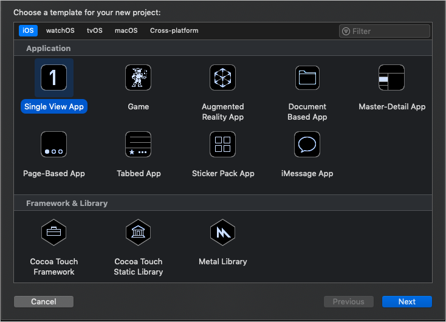
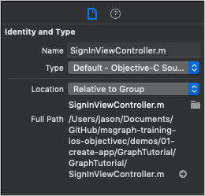
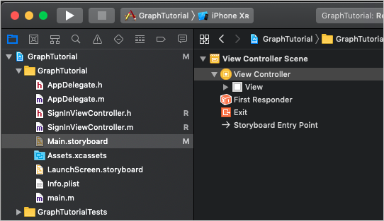
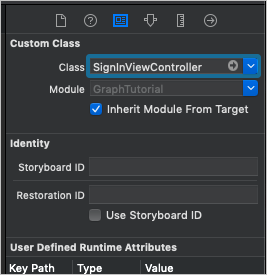
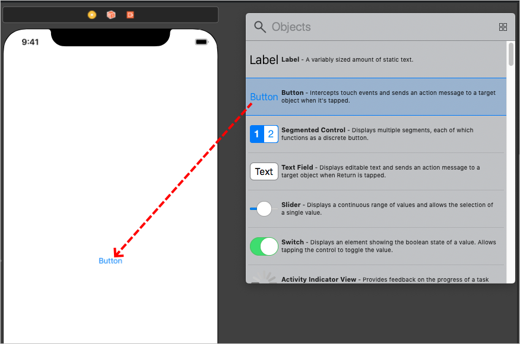
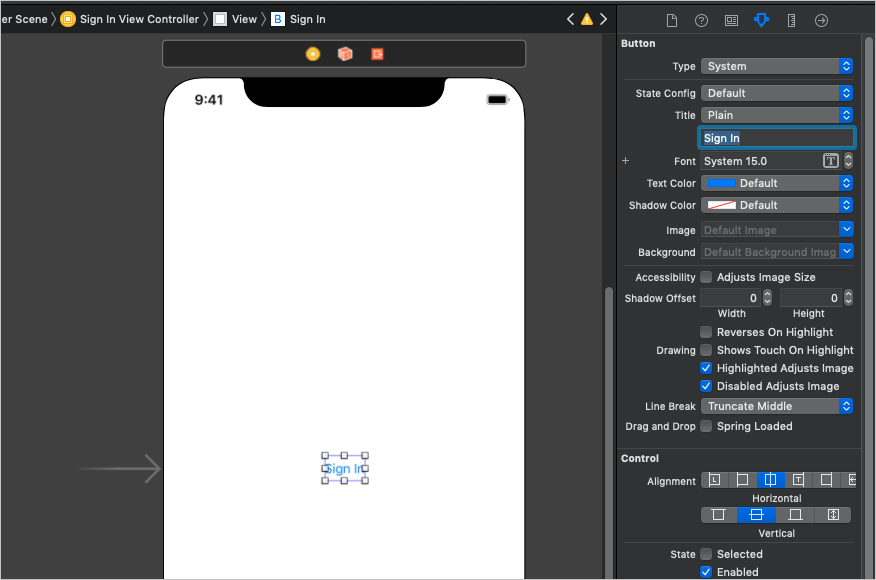
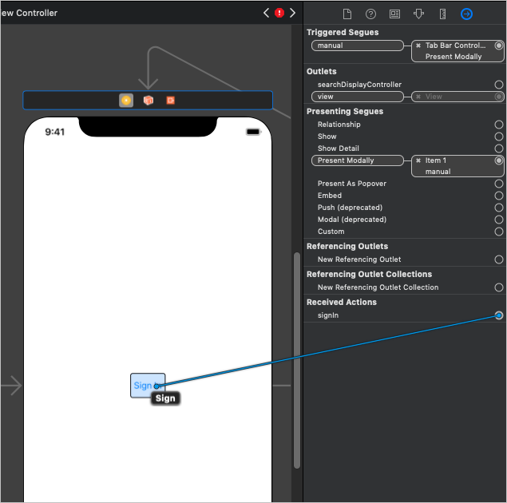
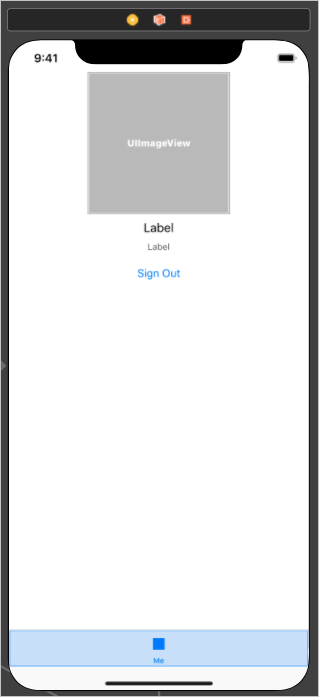

<!-- markdownlint-disable MD002 MD041 -->

Commencez par créer un projet SWIFT.

1. Ouvrez Xcode. Dans le menu **fichier** , sélectionnez **nouveau**, puis **projet**.
1. Choisissez le modèle d' **application vue unique** , puis sélectionnez **suivant**.

    

1. Définissez le **nom** du produit `GraphTutorial` sur et la **langue** sur **objectif-C**.
1. Renseignez les champs restants, puis cliquez sur **suivant**.
1. Choisissez un emplacement pour le projet et sélectionnez **créer**.

## <a name="install-dependencies"></a>Installer les dépendances

Avant de poursuivre, installez des dépendances supplémentaires que vous utiliserez plus tard.

- [Bibliothèque d’authentification Microsoft (MSAL) pour iOS](https://github.com/AzureAD/microsoft-authentication-library-for-objc) pour l’authentification auprès d’Azure ad.
- [Kit de développement logiciel (SDK) Microsoft Graph pour objective C](https://github.com/microsoftgraph/msgraph-sdk-objc) pour les appels à Microsoft Graph.
- [Kit de développement logiciel (SDK) des modèles Microsoft Graph pour objective C](https://github.com/microsoftgraph/msgraph-sdk-objc-models) pour les objets fortement typés représentant des ressources Microsoft Graph, comme des utilisateurs ou des événements.

1. Quittez Xcode.
1. Ouvrez terminal et modifiez le répertoire à l’emplacement de votre projet **GraphTutorial** .
1. Exécutez la commande suivante pour créer un Podfile.

    ```Shell
    pod init
    ```

1. Ouvrez le Podfile et ajoutez les lignes suivantes juste après la `use_frameworks!` ligne.

    ```Ruby
    pod 'MSAL', '~> 1.0.2'
    pod 'MSGraphClientSDK', ' ~> 1.0.0'
    pod 'MSGraphClientModels', '~> 1.3.0'
    ```

1. Enregistrez le Podfile, puis exécutez la commande suivante pour installer les dépendances.

    ```Shell
    pod install
    ```

1. Une fois la commande exécutée, ouvrez le **GraphTutorial. xcworkspace** nouvellement créé dans Xcode.

## <a name="design-the-app"></a>Concevoir l’application

Dans cette section, vous allez créer les affichages de l’application : une page de connexion, un navigateur de barre d’onglets, une page d’accueil et une page de calendrier. Vous allez également créer une superposition des indicateurs d’activité.

### <a name="create-sign-in-page"></a>Créer une page de connexion

1. Développez le dossier **GraphTutorial** dans Xcode, puis sélectionnez le fichier **ViewController. m** .
1. Dans l' **inspecteur de fichiers**, remplacez le **nom** du fichier par `SignInViewController.m`.

    

1. Ouvrez **SignInViewController. m** et remplacez son contenu par le code suivant.

    ```objc
    #import "SignInViewController.h"

    @interface SignInViewController ()

    @end

    @implementation SignInViewController

    - (void)viewDidLoad {
        [super viewDidLoad];
        // Do any additional setup after loading the view.
    }

    - (IBAction)signIn {
        [self performSegueWithIdentifier: @"userSignedIn" sender: nil];
    }
    @end
    ```

1. Sélectionnez le fichier **ViewController. h** .
1. Dans l' **inspecteur de fichiers**, remplacez le **nom** du fichier par `SignInViewController.h`.
1. Ouvrez **SignInViewController. h** et remplacez toutes les instances `ViewController` de `SignInViewController`par.

1. Ouvrez le fichier **principal. Storyboard** .
1. Développez **View Controller Scene**, puis sélectionnez **View Controller**.

    

1. Sélectionnez l' **inspecteur d’identité**, puis définissez la liste déroulante de **classe** sur **SignInViewController**.

    

1. Sélectionnez la **bibliothèque**, puis faites glisser un **bouton** sur le **contrôleur de vue de connexion**.

    

1. Lorsque le bouton est sélectionné, sélectionnez l' **inspecteur d’attributs** et remplacez le **titre** du bouton `Sign In`par.

    

1. Sélectionnez le **contrôleur d’affichage de connexion**, puis sélectionnez l' **inspecteur de connexions**.
1. Sous **actions reçues**, faites glisser le cercle non rempli en regard de **connexion** sur le bouton. Sélectionnez **retoucher** dans le menu contextuel.

    

1. Dans le menu **éditeur** , sélectionnez **résoudre les problèmes de disposition automatique**, puis sélectionnez **Ajouter les contraintes manquantes** sous **toutes les vues dans se connecter dans le contrôleur d’affichage**.

### <a name="create-tab-bar"></a>Créer une barre d’onglets

1. Sélectionnez la **bibliothèque**, puis faites glisser un **contrôleur de barre d’onglets** sur la table de montage séquentiel.
1. Sélectionnez le **contrôleur d’affichage de connexion**, puis sélectionnez l' **inspecteur de connexions**.
1. Sous **déclencheur SEGUES**, faites glisser le cercle qui n’est pas rempli en regard de **Manuel** sur le contrôleur de la **barre d’onglets** sur la table de montage séquentiel. Sélectionnez une **Présentation modale** dans le menu contextuel.

    

1. Sélectionnez le segue que vous venez d’ajouter, puis sélectionnez l' **inspecteur d’attributs**. Définissez le champ **identificateur** sur `userSignedIn`et définissez la **Présentation** en **plein écran**.

    

1. Sélectionnez la **scène de l’élément 1**, puis sélectionnez l' **inspecteur de connexions**.
1. Sous **déclencheur SEGUES**, faites glisser le cercle non rempli en regard de **Manuel** sur le **contrôleur de vue de connexion** sur la table de montage séquentiel. Sélectionnez une **Présentation modale** dans le menu contextuel.
1. Sélectionnez le segue que vous venez d’ajouter, puis sélectionnez l' **inspecteur d’attributs**. Définissez le champ **identificateur** sur `userSignedOut`et définissez la **Présentation** en **plein écran**.

### <a name="create-welcome-page"></a>Créer une page d’accueil

1. Sélectionnez le fichier **Assets. xcassets** .
1. Dans le menu **éditeur** , sélectionnez **Ajouter des ressources**, puis **nouveau jeu d’images**.
1. Sélectionnez la nouvelle **image** et utilisez l' **inspecteur d’attributs** pour définir son **nom** sur `DefaultUserPhoto`.
1. Ajoutez l’image que vous souhaitez utiliser comme photo de profil utilisateur par défaut.

    

1. Créez un fichier de **classe Touch de cacao** dans le dossier **GraphTutorial** nommé `WelcomeViewController`. Choisissez **UIViewController** dans la sous- **classe du** champ.
1. Ouvrez **WelcomeViewController. h** et ajoutez le code suivant à l' `@interface` intérieur de la déclaration.

    ```objc
    @property (nonatomic) IBOutlet UIImageView *userProfilePhoto;
    @property (nonatomic) IBOutlet UILabel *userDisplayName;
    @property (nonatomic) IBOutlet UILabel *userEmail;
    ```

1. Ouvrez **WelcomeViewController. m** et remplacez son contenu par le code suivant.

    ```objc
    #import "WelcomeViewController.h"

    @interface WelcomeViewController ()

    @end

    @implementation WelcomeViewController

    - (void)viewDidLoad {
        [super viewDidLoad];
        // Do any additional setup after loading the view.

        // TEMPORARY
        self.userProfilePhoto.image = [UIImage imageNamed:@"DefaultUserPhoto"];
        self.userDisplayName.text = @"Default User";
        [self.userDisplayName sizeToFit];
        self.userEmail.text = @"default@contoso.com";
        [self.userEmail sizeToFit];
    }

    - (IBAction)signOut {
        [self performSegueWithIdentifier: @"userSignedOut" sender: nil];
    }

    @end
    ```

1. Ouvrez **main. Storyboard**. Sélectionnez la **scène de l’élément 1**, puis sélectionnez l' **inspecteur d’identité**. Remplacez la valeur de la **classe** par **WelcomeViewController**.
1. À l’aide de la **bibliothèque**, ajoutez les éléments suivants à la scène de l' **élément 1**.

    - Affichage d’une **image**
    - Deux **étiquettes**
    - Un **bouton**

1. Sélectionnez la vue image, puis l' **inspecteur de taille**.
1. Définissez la **largeur** et la **hauteur** sur 196.
1. Sélectionnez la deuxième étiquette, puis l' **inspecteur d’attributs**.
1. Modifiez la **couleur** en **gris foncé**et remplacez la **police** par le **système 12,0**.
1. Sélectionnez le bouton, puis l' **inspecteur d’attributs**.
1. Remplacez le **titre** par `Sign Out`.
1. À l’aide de l' **inspecteur de connexions**, effectuez les connexions suivantes.

    - Liez la sortie **userDisplayName** à la première étiquette.
    - Reliez la sortie de **userEmail** à la deuxième étiquette.
    - Liez la sortie **userProfilePhoto** à la vue d’image.
    - Liez l’action **signOut** reçue au bouton **retoucher dans**.

1. Sélectionnez l’élément de la barre d’onglets au bas de la scène, puis sélectionnez l' **inspecteur des attributs**. Remplacez le **titre** par `Me`.
1. Dans le menu **éditeur** , sélectionnez **résoudre les problèmes de disposition automatique**, puis sélectionnez **Ajouter les contraintes manquantes** sous **toutes les vues dans le contrôleur d’affichage de bienvenue**.

La scène de bienvenue doit ressembler à ceci une fois que vous avez fini.



### <a name="create-calendar-page"></a>Créer une page de calendrier

1. Créez un fichier de **classe Touch de cacao** dans le dossier **GraphTutorial** nommé `CalendarViewController`. Choisissez **UIViewController** dans la sous- **classe du** champ.
1. Ouvrez **CalendarViewController. h** et ajoutez le code suivant à l' `@interface` intérieur de la déclaration.

    ```objc
    @property (nonatomic) IBOutlet UITextView *calendarJSON;
    ```

1. Ouvrez **CalendarViewController. m** et remplacez son contenu par le code suivant.

    ```objc
    #import "CalendarViewController.h"

    @interface CalendarViewController ()

    @end

    @implementation CalendarViewController

    - (void)viewDidLoad {
        [super viewDidLoad];
        // Do any additional setup after loading the view.

        // TEMPORARY
        self.calendarJSON.text = @"Calendar";
        [self.calendarJSON sizeToFit];
    }

    @end
    ```

1. Ouvrez **main. Storyboard**. Sélectionnez la **scène de l’élément 2**, puis sélectionnez l' **inspecteur d’identité**. Remplacez la valeur de la **classe** par **CalendarViewController**.
1. À l’aide de la **bibliothèque**, ajoutez un **affichage de texte** à la scène de l' **élément 2**.
1. Sélectionnez l’affichage de texte que vous venez d’ajouter. Dans l' **éditeur**, cliquez sur **incorporer dans**, puis sur **affichage à défilement**.
1. À l’aide de l' **inspecteur de connexions**, connectez la sortie **calendarJSON** à l’affichage de texte.
1. 1. Sélectionnez l’élément de la barre d’onglets au bas de la scène, puis sélectionnez l' **inspecteur des attributs**. Remplacez le **titre** par `Calendar`.
1. Dans le menu **éditeur** , sélectionnez **résoudre les problèmes de disposition automatique**, puis sélectionnez **Ajouter les contraintes manquantes** sous **toutes les vues dans le contrôleur d’affichage de bienvenue**.

La scène de calendrier doit ressembler à ceci une fois que vous avez fini.


### <a name="create-activity-indicator"></a>Indicateur de création d’activité

1. Créez un fichier de **classe Touch de cacao** dans le dossier **GraphTutorial** nommé `SpinnerViewController`. Choisissez **UIViewController** dans la sous- **classe du** champ.
1. Ouvrez **SpinnerViewController. h** et ajoutez le code suivant à l' `@interface` intérieur de la déclaration.

    ```objc
    - (void) startWithContainer:(UIViewController*) container;
    - (void) stop;
    ```

1. Ouvrez **SpinnerViewController. m** et remplacez son contenu par le code suivant.

    ```objc
    #import "SpinnerViewController.h"

    @interface SpinnerViewController ()
    @property (nonatomic) UIActivityIndicatorView* spinner;
    @end

    @implementation SpinnerViewController

    - (void)viewDidLoad {
        [super viewDidLoad];

        _spinner = [[UIActivityIndicatorView alloc] initWithActivityIndicatorStyle:
                    UIActivityIndicatorViewStyleWhiteLarge];

        self.view.backgroundColor = [UIColor colorWithWhite:0 alpha:0.7];
        [self.view addSubview:_spinner];

        _spinner.translatesAutoresizingMaskIntoConstraints = false;
        [_spinner startAnimating];

        [_spinner.centerXAnchor constraintEqualToAnchor:self.view.centerXAnchor].active = true;
        [_spinner.centerYAnchor constraintEqualToAnchor:self.view.centerYAnchor].active = true;
    }

    - (void) startWithContainer:(UIViewController *)container {
        [container addChildViewController:self];
        self.view.frame = container.view.frame;
        [container.view addSubview:self.view];
        [self didMoveToParentViewController:container];
    }

    - (void) stop {
        [self willMoveToParentViewController:nil];
        [self.view removeFromSuperview];
        [self removeFromParentViewController];
    }

    @end
    ```

## <a name="test-the-app"></a>Tester l'application

Enregistrez vos modifications et lancez l’application. Vous devriez pouvoir vous déplacer entre les écrans à l’aide des boutons **de connexion** et de **déconnexion** , ainsi que de la barre d’onglets.


