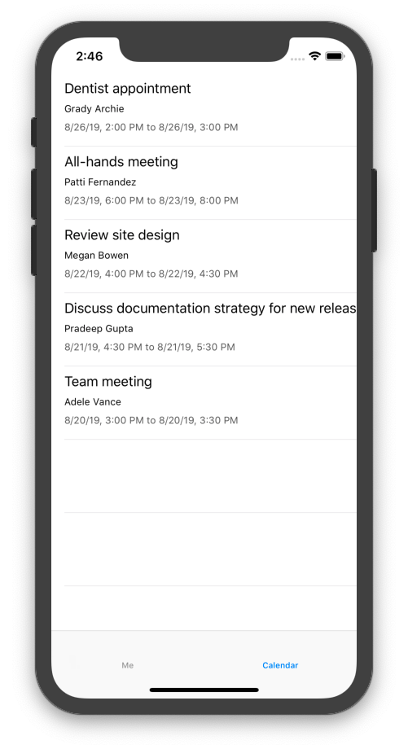

<!-- markdownlint-disable MD002 MD041 -->

Dans cet exercice, vous allez incorporer Microsoft Graph dans l’application. Pour cette application, vous allez utiliser le [Kit de développement logiciel (SDK) Microsoft Graph pour effectuer des](https://github.com/microsoftgraph/msgraph-sdk-objc) appels à Microsoft Graph.

## <a name="get-calendar-events-from-outlook"></a>Récupérer les événements de calendrier à partir d’Outlook

Dans cette section, vous allez étendre `GraphManager` la classe pour ajouter une fonction afin d’obtenir les événements de l' `CalendarViewController` utilisateur et la mise à jour pour utiliser ces nouvelles fonctions.

1. Ouvrez **GraphManager. h** et ajoutez le code suivant au- `@interface` dessus de la déclaration.

    ```objc
    typedef void (^GetEventsCompletionBlock)(NSData* _Nullable data, NSError* _Nullable error);
    ```

1. Ajoutez le code suivant à la `@interface` déclaration.

    ```objc
    - (void) getEventsWithCompletionBlock: (GetEventsCompletionBlock)completionBlock;
    ```

1. Ouvrez **GraphManager. m** et ajoutez la fonction suivante à la `GraphManager` classe.

    ```objc
    - (void) getEventsWithCompletionBlock:(GetEventsCompletionBlock)completionBlock {
        // GET /me/events?$select='subject,organizer,start,end'$orderby=createdDateTime DESC
        NSString* eventsUrlString =
        [NSString stringWithFormat:@"%@/me/events?%@&%@",
         MSGraphBaseURL,
         // Only return these fields in results
         @"$select=subject,organizer,start,end",
         // Sort results by when they were created, newest first
         @"$orderby=createdDateTime+DESC"];

        NSURL* eventsUrl = [[NSURL alloc] initWithString:eventsUrlString];
        NSMutableURLRequest* eventsRequest = [[NSMutableURLRequest alloc] initWithURL:eventsUrl];

        MSURLSessionDataTask* eventsDataTask =
        [[MSURLSessionDataTask alloc]
         initWithRequest:eventsRequest
         client:self.graphClient
         completion:^(NSData *data, NSURLResponse *response, NSError *error) {
             if (error) {
                 completionBlock(nil, error);
                 return;
             }

             // TEMPORARY
             completionBlock(data, nil);
         }];

        // Execute the request
        [eventsDataTask execute];
    }
    ```

    > [!NOTE]
    > Examinez le contenu du `getEventsWithCompletionBlock` code.
    >
    > - L’URL qui sera appelée est `/v1.0/me/events`.
    > - Le `select` paramètre de requête limite les champs renvoyés pour chaque événement à seulement ceux que l’application utilisera réellement.
    > - Le `orderby` paramètre de requête trie les résultats en fonction de la date et de l’heure de leur création, avec l’élément le plus récent en premier.

1. Ouvrez **CalendarViewController. m** et remplacez l’intégralité de son contenu par le code suivant.

    ```objc
    #import "CalendarViewController.h"
    #import "SpinnerViewController.h"
    #import "GraphManager.h"
    #import <MSGraphClientModels/MSGraphClientModels.h>

    @interface CalendarViewController ()

    @property SpinnerViewController* spinner;

    @end

    @implementation CalendarViewController

    - (void)viewDidLoad {
        [super viewDidLoad];
        // Do any additional setup after loading the view.

        self.spinner = [SpinnerViewController alloc];
        [self.spinner startWithContainer:self];

        [GraphManager.instance
         getEventsWithCompletionBlock:^(NSData * _Nullable data, NSError * _Nullable error) {
             dispatch_async(dispatch_get_main_queue(), ^{
                 [self.spinner stop];

                 if (error) {
                     // Show the error
                     UIAlertController* alert = [UIAlertController
                                                 alertControllerWithTitle:@"Error getting events"
                                                 message:error.debugDescription
                                                 preferredStyle:UIAlertControllerStyleAlert];

                     UIAlertAction* okButton = [UIAlertAction
                                                actionWithTitle:@"OK"
                                                style:UIAlertActionStyleDefault
                                                handler:nil];

                     [alert addAction:okButton];
                     [self presentViewController:alert animated:true completion:nil];
                     return;
                 }

                 // TEMPORARY
                 self.calendarJSON.text = [[NSString alloc] initWithData:data encoding:NSUTF8StringEncoding];
                 [self.calendarJSON sizeToFit];
             });
         }];
    }

    @end
    ```

1. Exécutez l’application, connectez-vous, puis appuyez sur l’élément de navigation **calendrier** dans le menu. Vous devriez voir un dump JSON des événements dans l’application.

## <a name="display-the-results"></a>Afficher les résultats

À présent, vous pouvez remplacer le vidage JSON par un texte pour afficher les résultats de manière conviviale. Dans cette section, vous allez modifier la `getEventsWithCompletionBlock` fonction pour renvoyer des objets fortement typés et modifier `CalendarViewController` pour qu’elle affiche les événements à l’aide d’un affichage tableau.

### <a name="update-getevents"></a>Mettre à jour getEvents

1. Ouvrez **GraphManager. h**. Modifiez la `GetEventsCompletionBlock` définition de type comme suit.

    ```objc
    typedef void (^GetEventsCompletionBlock)(NSArray<MSGraphEvent*>* _Nullable events, NSError* _Nullable error);
    ```

1. Ouvrez **GraphManager. m**. Remplacez la `completionBlock(data, nil);` ligne dans la `getEventsWithCompletionBlock` fonction par le code suivant.

    :::code language="objc" source="../demo/GraphTutorial/GraphTutorial/GraphManager.m" id="GetEventsSnippet" highlight="24-43":::

### <a name="update-calendarviewcontroller"></a>Mettre à jour CalendarViewController

1. Créez un fichier de **classe Touch de cacao** dans le projet **GraphTutorial** nommé `CalendarTableViewCell`. Choisissez **UITableViewCell** dans la sous- **classe du** champ.
1. Ouvrez **CalendarTableViewCell. h** et remplacez son contenu par le code suivant.

    :::code language="objc" source="../demo/GraphTutorial/GraphTutorial/CalendarTableViewCell.h" id="CalendarTableCellSnippet":::

1. Ouvrez **CalendarTableViewCell. m** et remplacez son contenu par le code suivant.

    :::code language="objc" source="../demo/GraphTutorial/GraphTutorial/CalendarTableViewCell.m" id="CalendarTableCellSnippet":::

1. Ouvrez **main. Storyboard** et localisez la **scène de calendrier**. Sélectionnez l' **affichage** dans la **scène de calendrier** et supprimez-le.

    

1. Ajoutez un **affichage tableau** de la **bibliothèque** à la **scène calendrier**.
1. Sélectionnez l’affichage tableau, puis sélectionnez l' **inspecteur d’attributs**. Définissez les **cellules prototype** sur **1**.
1. Utilisez la **bibliothèque** pour ajouter trois **étiquettes** à la cellule prototype.
1. Sélectionnez la cellule prototype, puis l' **inspecteur d’identité**. Modifiez **Class** en **CalendarTableViewCell**.
1. Sélectionnez l' **inspecteur d’attributs** et définissez **identificateur** sur `EventCell`.
1. Une fois le **EventCell** sélectionné, sélectionnez l' **inspecteur** de connexions `durationLabel`et `organizerLabel`Connectez- `subjectLabel` vous, puis les étiquettes que vous avez ajoutées à la cellule sur la table de montage séquentiel.
1. Définissez les propriétés et les contraintes sur les trois étiquettes comme suit.

    - **Étiquette de l’objet**
        - Ajouter une contrainte : espace de début à la marge de début de l’affichage du contenu, valeur : 0
        - Ajouter une contrainte : espace de fin à la marge de fin de l’affichage du contenu, valeur : 0
        - Ajouter une contrainte : espace à la marge supérieure de l’affichage du contenu, valeur : 0
    - **Étiquette de l’organisateur**
        - Police : système 12,0
        - Ajouter une contrainte : espace de début à la marge de début de l’affichage du contenu, valeur : 0
        - Ajouter une contrainte : espace de fin à la marge de fin de l’affichage du contenu, valeur : 0
        - Ajouter une contrainte : espace vers le bas de l’étiquette d’objet, valeur : standard
    - **Étiquette de durée**
        - Police : système 12,0
        - Couleur : gris foncé
        - Ajouter une contrainte : espace de début à la marge de début de l’affichage du contenu, valeur : 0
        - Ajouter une contrainte : espace de fin à la marge de fin de l’affichage du contenu, valeur : 0
        - Ajouter une contrainte : espace vers le bas de l’étiquette de l’organisateur, valeur : standard
        - Ajouter une contrainte : espace inférieur au contenu afficher la marge inférieure, valeur : 8

    

1. Ouvrez **CalendarViewController. h** et supprimez `calendarJSON` la propriété.
1. Modifiez la `@interface` déclaration comme suit.

    ```objc
    @interface CalendarViewController : UITableViewController
    ```

1. Ouvrez **CalendarViewController. m** et remplacez son contenu par le code suivant.

    :::code language="objc" source="../demo/GraphTutorial/GraphTutorial/CalendarViewController.m" id="CalendarViewSnippet":::

1. Exécutez l’application, connectez-vous, puis appuyez sur l’onglet **calendrier** . La liste des événements doit s’afficher.

    
